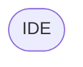

# Editor Files Documentation
This document describes the purposes and usages of the files present in the [Java](../src/main/java/com/rivan/android/studio/visualize/editor) and [Kotlin](../src/main/kotlin/com/rivan/android/studio/visualize/editor) editor directories.

## Descriptions
Descriptions of terms used inside files are provided below.

### FileEditorProvider

<ul>
  <li>A FileEditorProvider is a class that provides an editor for all types of files.</li>
  <li>The editor to be created is another class that extends the <strong><a href="../docs/EditorFilesDoc.md#fileeditor">FileEditor</a></strong>.</li>
  <li>A FileEditorProvider overrides atleast 4 methods, i.e.,
        

accept()

          <ul>
            <li>The <strong>accept()</strong> method is used to determine if the file is accepted by the provider.</li>
            <li>The method is called by the IDE to determine if the provider can handle the file.</li>
            <li>The method returns true if the file is accepted by the provider or false if otherwise.</li>
          </ul>
        

      

createEditor()

          <ul>
            <li>The <strong>createEditor()</strong> method is used to create an editor for the file.</li>
            <li>The method is called by the IDE to create an editor for the file.</li>
            <li>The method returns an instance of the editor to be shown.</li>
          </ul>
        

      

getEditorTypeId()

          <ul>
            <li>The <strong>getEditorTypeId()</strong> method is used to get the type of the editor.</li>
            <li>The method is called by the IDE to get the type of the editor.</li>
            <li>The method returns a string that represents the type of the editor.</li>
          </ul>
        

      

getPolicy()

          <ul>
            <li>The <strong>getPolicy()</strong> method is used to get the policy of the editor.</li>
            <li>The method is called by the IDE to get the policy of the editor.</li>
            <li>The method returns an instance of the policy to be used.</li>
            <li>There are 4 policies available, they are:</li>
            

NONE

              No policies are to be used.
            

            

PLACE_BEFORE_DEFAULT_EDITOR

              Place the provided editor before the default editor.
            

            

PLACE_AFTER_DEFAULT_EDITOR

              Place the provided editor after the default editor.
            

            

HIDE_DEFAULT_EDITOR

              Hide the default editor. <strong>The above policies do not hide the default editor.</strong>
            

          </ul>
        

  </li>
</ul>

### FileEditor

<ul>
  <li>A FileEditor is a class that creates an editor to be shown in the IDE by a provider.</li>
  <li>A FileEditor uses Java Swing components to populate its views.</li>
  <li>A FileEditor overrides atleast 8 methods, i.e.,
    

getComponent()

      <ul>
        <li>This method is called by the IDE to get the component to be shown in the IDE.</li>
        <li>The method returns a Java Swing component to be shown in the IDE.</li>
      </ul>
    

    

getPreferredFocusedComponent()

      <ul>
        <li>This method is called by the IDE to get the preferred focused component.</li>
        <li>The method returns a Java Swing component to be focused.</li>
      </ul>
    

    

getName()

        <ul>
            <li>This method is called by the IDE to get the name of the editor.</li>
            <li>The method returns a string that represents the name of the editor.</li>
        </ul>
    

    

isModified()

        
No information available yet.

    

    

isValid()

      <ul>
        <li>This method is called by the IDE to determine if the editor is valid.</li>
        <li>The method returns true if the editor is valid or false if otherwise.</li>
        <li>The editor won't show up if it is set to false.</li>
      </ul>
    

    

getCurrentLocation()

      
No information available yet.

    

    

addPropertyChangeListener()

      
No information available yet.

    

    

removePropertyChangeListener()

      
No information available yet.

    

  </li>
</ul>

## Diagram
Diagrammatic representation of how the editor files work is provided below.

